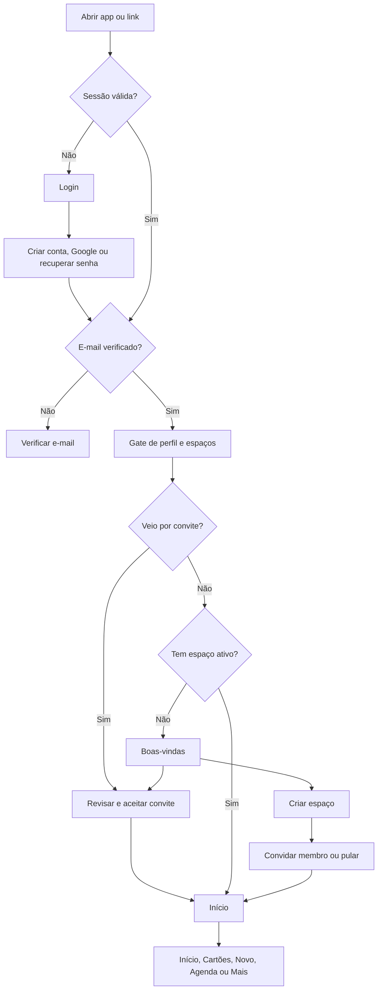

# Workflow do Nossa Grana

Este documento consolida o fluxo de produto a partir do `promptInicial.txt`, dos
19 protótipos-base, das 10 versões animadas, dos 4 estados de erro e das rotas
Flutter existentes. Ele descreve o comportamento esperado do aplicativo, não
apenas uma sequência de telas isoladas.

## Princípios que guiam o fluxo

- O usuário deve ver limite disponível, faturas e próximos vencimentos assim
  que entra no app.
- O primeiro uso precisa explicar o conceito de espaço financeiro antes de
  pedir dados financeiros.
- Nenhuma tela financeira pode ser acessada sem usuário autenticado, e-mail
  verificado e associação ativa a um espaço.
- O botão central `Novo` é o ponto único para criar informações e deve sempre
  mostrar opções, salvo quando um pré-requisito leva diretamente à criação do
  primeiro cartão.
- Toda gravação mostra progresso, sucesso ou erro no contexto da ação. Erros de
  campo permanecem próximos ao campo, como nos protótipos de feedback.
- A navegação inferior permanece visível nas cinco áreas principais. Fluxos de
  edição, pagamento e onboarding usam telas empilhadas com voltar/fechar.
- OWNER e EDITOR podem criar dados; VIEWER vê as mesmas informações, mas recebe
  ações desabilitadas com uma explicação de permissão.

## Mapa geral

## 1. Entrada, login e criação de conta

1. O app abre em `/gate`, que resolve a sessão, o perfil Data Connect e os
   espaços do usuário.
2. Sem sessão, vai para `/login`. A tela segue o protótipo de login: e-mail,
   senha, exibir/ocultar senha, recuperar senha, entrar, Google e criar conta.
3. Dados inválidos usam o estado `login_feedback_de_erro`: borda, ícone e texto
   de erro no campo. Falha de rede ou credencial geral também gera mensagem
   amigável, sem expor erro técnico.
4. `Criar conta` abre `/create-account`. Nome, e-mail, senha, confirmação e
   aceite dos termos são validados conforme o protótipo normal e sua versão de
   erro.
5. Após cadastro, o app envia a verificação e abre `/verify-email`. Reenviar,
   verificar novamente e sair são ações possíveis.
6. Login por Google também passa pelo gate; se o provedor já confirma o e-mail,
   segue direto para a resolução do espaço.
7. `Esqueci minha senha` solicita o e-mail na própria experiência de login,
   envia o link e confirma sem revelar se existe ou não uma conta.
8. Se o usuário abriu uma URL protegida ou um convite antes do login, essa URL
   fica em `redirect` e é retomada após autenticação e verificação.

## 2. Primeiro login e criação do espaço

Quando o perfil não possui membership ativa, o gate abre `/welcome`:

1. A tela `boas_vindas` explica o espaço financeiro e oferece duas escolhas.
2. `Criar um espaço financeiro` abre `/create-space`.
3. O usuário define nome e cor. Ao salvar, a operação cria atomicamente o
   espaço e o primeiro membro OWNER.
4. O app abre `/invite-member?onboarding=true`.
5. O OWNER informa e-mail e escolhe EDITOR ou VIEWER. Pode enviar o convite,
   copiar um link ou escolher `Convidar depois`/`Pular`.
6. Qualquer uma das saídas válidas conclui o onboarding em `/app/home`.
7. O dashboard vazio explica o próximo passo. Sem cartão, a ação principal é
   `Adicionar primeiro cartão`; depois disso, o botão `Novo` passa a permitir
   compras.

O convite é opcional porque o usuário pode começar sozinho e convidar em
`Mais > Espaço financeiro e membros` posteriormente.

## 3. Entrada por convite

1. O link tem o formato `/join-space?invite=TOKEN`.
2. Sem login, o router preserva todo o link e conduz por login/verificação.
3. Em `/join-space`, o app mostra nome do espaço, papel concedido, pessoa que
   convidou e e-mail de destino antes da confirmação.
4. `Aceitar convite` valida token, validade, status e correspondência com o
   e-mail verificado; então cria a membership e abre `/app/home` no novo espaço.
5. Token inválido, expirado, revogado ou destinado a outro e-mail mantém o
   usuário na tela com explicação e caminhos para voltar ou usar outro convite.
6. Se já for membro, a ação é idempotente e apenas seleciona o espaço.

## 4. Usuário recorrente e troca de espaço

- Com uma única membership, `/gate` seleciona o espaço e abre `/app/home`.
- Com várias memberships, reutiliza o último espaço ativo; se ele não existir
  mais, usa a membership mais recente.
- Tocar no nome do espaço no cabeçalho abre o seletor. Nele o usuário troca de
  espaço, gerencia membros ou escolhe `Criar ou entrar em outro espaço`.
- A troca recarrega dashboard, cartões, faturas, agenda, empréstimos, categorias
  e atividades. Dados de um espaço nunca permanecem visíveis no outro.

## 5. Navegação principal

| Aba | Rota | Função |
| --- | --- | --- |
| Início | `/app/home` | Resumo de faturas, limites, cartões, vencimentos e atividades |
| Cartões | `/app/cards` | Limites consolidados, cartões e acesso às faturas |
| Novo | bottom sheet | Escolha de uma nova compra, cartão ou empréstimo |
| Agenda | `/app/agenda` | Calendário e compromissos por período e estado |
| Mais | `/app/more` | Empréstimos, categorias, membros, alertas, instalação e conta |

O sino do cabeçalho abre `/notifications`. Tocar no nome do espaço abre o
seletor de espaço, não uma tela financeira.

## 6. Botão central “Novo”

Ao tocar no botão central, o fluxo-alvo abre uma bottom sheet com:

1. `Nova compra` — ação principal, rota `/new-purchase`.
2. `Novo cartão` — rota `/new-card`.
3. `Novo empréstimo` — rota `/new-loan`.

Regras:

- Sem cartão cadastrado, `Nova compra` aparece bloqueada com a explicação
  “Cadastre um cartão primeiro” e um atalho para `/new-card`.
- VIEWER vê as opções bloqueadas e a mensagem “Seu acesso é somente leitura”.
- Fechar a sheet mantém a aba e a posição atuais.
- Após salvar, o app fecha o fluxo, atualiza os dados e mostra confirmação.
- Não colocar configurações ou convite no `Novo`; essas ações vivem em `Mais`.

## 7. Compra, parcelas e detalhes

1. `Nova compra` abre o protótipo `adicionar_compra`: valor, descrição, data,
   cartão, categoria, tipo à vista/parcelado e quantidade de 1 a 24 parcelas.
2. A prévia muda em tempo real e mostra valor das parcelas, primeira fatura,
   última fatura e limite restante.
3. `Salvar compra` desabilita durante o envio. A criação persiste compra,
   parcelas e faturas como uma unidade lógica.
4. Erros de valor/descrição usam o protótipo
   `adicionar_compra_feedback_de_erro`; falhas remotas preservam o formulário.
5. Sucesso atualiza o dashboard e abre o detalhe da compra ou retorna ao início
   com snackbar e destaque visual na atividade recente.
6. O detalhe `/purchase/:purchaseId` mostra valor, categoria, cartão, autor e a
   linha do tempo de parcelas.
7. `Editar` reutiliza os campos permitidos. Se a fatura estiver fechada, explica
   a política antes de alterar.
8. `Cancelar compra` exige confirmação destrutiva, mantém auditoria e atualiza
   parcelas, faturas e limite antes de voltar ao início.

## 8. Cartões, faturas e pagamentos

1. `/app/cards` mostra limite total, disponível e um painel por cartão.
2. `Adicionar cartão compartilhado` ou `Novo > Novo cartão` abre `/new-card`.
   Solicita apelido, últimos quatro dígitos, titular, limite, fechamento,
   vencimento e cor — nunca número completo, CVV ou senha.
3. Tocar em um cartão com fatura abre `/invoice/:invoiceId`.
4. O detalhe da fatura mostra estado, total, pago, pendente e compras do mês.
5. Tocar em uma compra abre seu detalhe. `Compartilhar resumo` usa somente dados
   não sensíveis.
6. `Registrar pagamento` abre `/invoice/:invoiceId/payment`.
7. O usuário escolhe valor parcial ou total e data; a tela antecipa o saldo
   restante. A identidade de quem paga vem da sessão.
8. A confirmação registra uma operação idempotente, recalcula fatura/limite e
   volta ao dashboard atualizado.

## 9. Agenda

- `/app/agenda` abre no mês atual.
- Setas mudam o mês; tocar em um dia filtra a lista.
- Filtros: todos, faturas, empréstimos, próximos e vencidos.
- Uma fatura abre seu detalhe; um empréstimo abre a área de empréstimos.
- Pago, pendente, próximo e vencido usam texto/ícone além de cor.
- O estado animado deve suavizar troca de mês e filtragem sem esconder dados.

## 10. Empréstimos

1. `Mais > Empréstimos` abre `/loans` com saldo devedor total, próxima parcela e
   contratos ativos.
2. `Adicionar empréstimo` ou `Novo > Novo empréstimo` abre `/new-loan`.
3. O formulário coleta nome, instituição, principal, juros, parcelas, primeiro
   vencimento e observação, exibindo simulação antes de salvar.
4. Após salvar, retorna à lista com o cronograma criado e os vencimentos passam
   a aparecer na agenda e no dashboard.
5. O fluxo final deverá incluir detalhe do contrato, parcela, pagamento parcial
   ou total, reversão e quitação; essas telas estão pedidas no prompt, mas ainda
   não possuem protótipo próprio.

## 11. Mais e configurações

`/app/more` organiza ações menos frequentes:

- `Empréstimos` → `/loans`.
- `Categorias` → `/categories`. Lista categorias padrão e permite criar uma.
- `Espaço financeiro e membros` → `/members`.
- `Lembretes e notificações` → `/notifications`.
- `Instalar aplicativo` → `/install`, somente na Web/PWA.
- `Perfil` → rota futura de nome, foto e e-mail.
- `Segurança` → rota futura de senha, provedores e sessões.
- `Ajuda` → rota futura de suporte e perguntas frequentes.
- `Sair` → encerra a sessão, limpa o espaço selecionado e volta ao login.

### Membros e convites

Em `/members`, todos veem membros, papéis e atividades. OWNER pode convidar,
alterar EDITOR/VIEWER, remover membro, revogar convites e transferir propriedade.
EDITOR e VIEWER não veem controles administrativos ativos. `Convidar pessoa`
reutiliza `/invite-member` e suas validações do protótipo.

### Categorias

Em `/categories`, criar categoria abre um modal curto. O fluxo final também deve
editar e arquivar categorias não utilizadas; categorias vinculadas a histórico
não são apagadas fisicamente.

### Lembretes

Em `/notifications`, o usuário ativa os lembretes, escolhe fechamento, fatura e
empréstimo, antecedência e horário. Permissão do navegador/sistema só é pedida
após tocar em `Permitir`. Salvar persiste preferências individuais.

### Instalação PWA

`/install` detecta plataforma. No Safari: abrir no Safari, Compartilhar,
Adicionar à Tela de Início e ativar `Abrir como App da Web`. No Android nativo,
o item não deve aparecer; na Web Android, usa o prompt instalável quando
disponível.

## 12. Estados transversais e movimento

- Entrada de telas empilhadas: fade + deslocamento curto; retorno mais rápido.
- Troca de abas: transição leve sem empilhar histórico.
- Listas e cards: entrada escalonada curta somente no primeiro carregamento.
- Salvar: botão em loading, campos preservados e prevenção de toque duplicado.
- Sucesso: snackbar e atualização localizada; não abrir uma tela sem saída.
- Erro de campo: protótipos vermelhos com mensagem associada e foco no primeiro
  campo inválido.
- Erro remoto: mensagem humana e botão `Tentar novamente`.
- Vazio: explica o benefício e oferece uma única ação de próximo passo.
- Offline: banner persistente, leitura marcada como possivelmente desatualizada
  e escrita financeira bloqueada quando não houver garantia transacional.
- Sessão expirada: volta ao login preservando a rota pretendida.
- Ações destrutivas: diálogo de confirmação e feedback após concluir.

## 13. Cobertura dos protótipos

Os protótipos cobrem estes 19 destinos-base:

- autenticação: login e criar conta;
- onboarding: boas-vindas, criar espaço e convidar membro;
- navegação: início, cartões, agenda e mais;
- finanças: adicionar compra, detalhe da compra, detalhe da fatura, registrar
  pagamento, empréstimos e adicionar empréstimo;
- gestão: categorias, membros, lembretes e instalar aplicativo.

As versões `animado` especificam movimento para login, conta, boas-vindas,
espaço, convite, início, cartões, compra, agenda e membros. As versões
`feedback_de_erro` especificam validação para login, conta, convite e compra.

As telas sem protótipo dedicado foram construídas reutilizando o mesmo sistema:
verificação de e-mail, aceitar convite, cadastro/edição/detalhe de cartão,
detalhe e pagamento de empréstimo, convites pendentes, perfil, segurança,
ajuda, offline e configuração do workspace.

## 14. Rotas implementadas

As rotas cobrem autenticação, onboarding, cinco áreas principais, bottom sheet
`Novo`, compras, cartões, faturas, pagamentos, empréstimos, categorias,
membros, convites pendentes, múltiplos espaços, notificações, instalação,
perfil, segurança, ajuda e estado offline. A interface aplica OWNER, EDITOR e
VIEWER antes de enviar mutations, além da autorização obrigatória no backend.

Tokens push e preferências detalhadas são persistidos. A entrega agendada de
push e o envio de convites por e-mail continuam dependentes de um worker e de
um provedor de e-mail configurados fora do aplicativo cliente.
